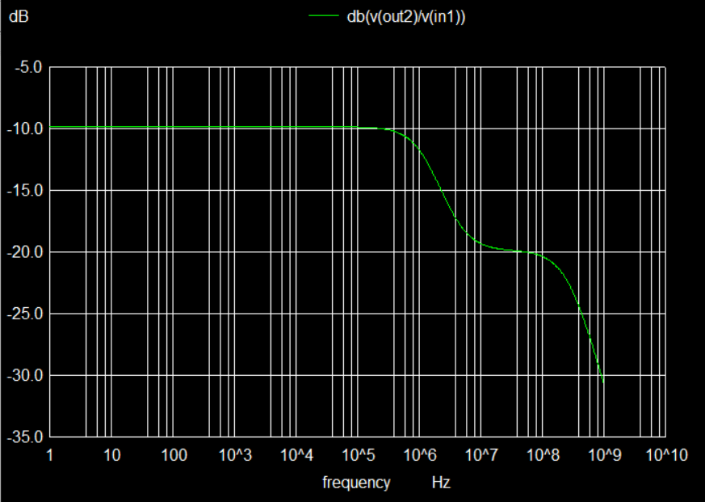

# avsd_opamp - IP Design


This project presents the design of a Two Stage CMOS Operational Amplifier using open source SkyWater 130nm Technology

  

# Contents
- [Open Source Tools Used](#Open-Source-Tools-Used)
- [Block Diagram](#Block-Diagram)
- [Specifications](#Specifications)
- [Installation](#Installation)
    - [eSim Installation](#eSim-Installation)
    - [Ngspice Installation](#Ngspice-Installation)
    - [SkyWater PDK Installation](#SkyWater-PDK-Installation)
    - [Magic Installation](#Magic-Installation)

- [Clone This Project](#Clone-This-Project)
- [Pre Layout Schematic and Simulations](#Pre-Layout-Schematic-and-Simulations)
- [Layout Design Using Magic](#Layout-Design-Using-Magic)
- [Post Layout Simulations](#Post-Layout-Simulations)
- [Future Work](#Future-Work)
- [Author](#Author)
- [Acknowledgements](#Acknowledgements)


# Open-Source-Tools-Used

- eSim 
    - eSim (previously known as Oscad / FreeEDA) is a free/libre and open source EDA tool for circuit design, simulation, analysis and PCB design. It is an integrated tool built using free/libre and open source software such as KiCad, Ngspice and GHDL. eSim is released under GPL.
    - https://esim.fossee.in/home

- Ngspice
    - ngspice is the open source spice simulator for electric and electronic circuits.
    - http://ngspice.sourceforge.net/

- SkyWater Open Source PDK
    - The SkyWater Open Source PDK is a collaboration between Google and SkyWater Technology Foundry to provide a fully open source Process Design Kit and related resources, which can be used to create manufacturable designs at SkyWater’s facility.
    - https://github.com/google/skywater-pdk

- Magic
    - Magic is a venerable VLSI layout tool, written in the 1980's at Berkeley by John Ousterhout, now famous primarily for writing the scripting interpreter language Tcl. Due largely in part to its liberal Berkeley open-source license, magic has remained popular with universities and small companies. The open-source license has allowed VLSI engineers with a bent toward programming to implement clever ideas and help magic stay abreast of fabrication technology.
    - http://opencircuitdesign.com/magic/

# Block Diagram


# Specifications

<table>
<tr>
    <th>Specification</th>
    <th>Value</th>
</tr>
<tr>
    <td>Differential Gain</td>
    <td>31.55dB</td>
</tr>
<tr>
    <td>CMRR</td>
    <td>41.4dB</td>
</tr>
<tr>
    <td>Gain Bandwidth Product</td>
    <td>46MHz</td>
</tr>
<tr>
    <td>Phase Margin</td>
    <td>101.93&deg;</td>
</tr>
<tr>
    <td>Input Offset Voltage</td>
    <td>-24.55mV</td>
</tr>
<tr>
    <td>Power Dissipation<sup>*</sup></td>
    <td>17&micro;W</td>
</tr>
<tr>
    <td>Slew Rate</td>
    <td>180 V/&micro;s</td>
</tr>
</table>
<sup>*</sup> - Power Dissipation measured at 60Hz 1mV p-p sinusoid with 1k&Omega;

# Installation
- The eSim Software is currently available for Windows 7, 8 and 10 and Ubuntu 16.04 LTS and above

- The Magic Design Tool is available for Ubuntu
- Ngspice is installed when eSim is installed, but if any other version is needed please follow the steps mentioned

- The Pre-requisites for installing the following in Ubuntu are
    - git 
    - make

- Install them using

    To make sure that you install the latest version of the software(that is the package information is up to date)
    ```
    $ sudo apt-get update
    ```

    ```
    $ sudo apt install git

    $ sudo apt install make
    ```

## eSim Installation
- https://static.fossee.in/esim/installation-files/Install_eSim_on_Windows.pdf

- https://github.com/FOSSEE/eSim/blob/master/INSTALL

## Ngspice Installation
- http://ngspice.sourceforge.net/download.html

## SkyWater PDK Installation
- In Windows
    - Download the GitHub Repository : https://github.com/google/skywater-pdk

- In Ubuntu
In terminal, execute the following commands

- To download the repository into the current working directory
    ```
    $ git clone git://opencircuitdesign.com/open_pdks
    ```

- Go to `open_pks` directory
    ```
    $ cd open_pdks
    ```

- Configure and install
    ```
    $ ./configure --enable-sky130-pdk

    $ make

    $ sudo make install
    ```

## Magic Installation
In terminal, execute the following commands

- To download the repository into the current working directory
    ```
    $ git clone git://opencircuitdesign.com/magic
    ```

- Go to `magic` directory

    ```
    $ cd magic
    ```

- Configure and install
    ```
    $ sudo ./configure

    $ sudo make

    $ sudo make install
    ```
# Clone This Project
To Clone this repository, execute the following from terminal
```
$ git clone https://github.com/rohinthram/avsd_opamp
```
Or download and extract the files

# Pre Layout Schematic and Simulations
- Go to the directory  `pre_layout/pre_layout_simulation` 
    ```
    $ cd pre_layout/pre_layout_simulation
    ```
- Execute each and every `.cir` using `ngspice` command from terminal
    ```
    $ ngspice <file-name>
    ```
    - Replace `<file-name>` with file name of the analysis required
- The necessary plot is obtained upon successful execution of the file

## Differential Mode Gain

```
$ ngspice differential_gain.cir
```


## Common Mode Gain
```
$ ngspice common_mode_gain.cir
```


## Offset Voltage
```
$ ngspice offset_voltage.cir
```


## Input Noise Spectrum

```
$ ngspice input_noise_spectrum.cir
```	
For obtaining Noise Spectrum 
- Please run the following commands in the ngspice window for obtaining the plot


- Use `setplot` to see all plots available

    ```
    ngspice-> setplot
    ```

- select the plot which has "Noise Spectral Density Curves".For example,
    ```
    ngspice-> setplot noise1
    ```
- Then plot the graph using the command
    ```
    ngspice-> plot inoise_spectrum
    ```


## Power Dissipation
```
$ ngspice power_dissipation.cir
```


## Slew Rate
```
$ ngspice slew_rate.cir
```


A much easier plot to see slew rate could be obtained by chaning the analysis as
```
.tran 0.01u 2u
```


## Transient Analysis
```
$ ngspice transient.cir
```


# Layout Design Using Magic
Copy `sky130A.tech` file and paste in the directory where we want to work with *magic* 
Or execute the following command in the terminal
```
cp avsd_opamp/skywater_pdk/sky130A.tech <target-destination>
```

- Magic Workspace :


- Save the changes made using
    ```
    % save <file-name>
    ```

- Conversion of **.mag** file into ngspice executable
    - Extract the **.mag** file using (from tkcon terminal)(magic terminal)
        ```
        % extract all
        ```
    - Convert **.ext** to **.spice** using
        ```
        % ext2spice
        ```
- Make necessary changes to the **.spice** file so that it can be run in `ngspice` (The modified file can be found in *post_layout/post_layout_simulations* directory)

# Post Layout Simulations
- Go to the directory  `post_layout/post_layout_simulation` by executing the command from parent directory
    ```
    $ cd post_layout/post_layout_simulation
    ```
- Execute each and every `.cir` using `ngspice` command from terminal
    ```
    $ ngspice <file-name>
    ```
    - Replace `<file-name>` with file name of the analysis required
- The necessary plot is obtained upon successful execution of the file

## Differential Mode Gain

```
$ ngspice differential_gain.cir
```


## Common Mode Gain
```
$ ngspice common_mode_gain.cir
```



## Offset Voltage
```
$ ngspice offset_voltage.cir
```


## Input Noise Spectrum

```
$ ngspice input_noise_spectrum.cir
```	
For obtaining Noise Spectrum 
- Please run the following commands in the ngspice window for obtaining the plot


- Use `setplot` to see all plots available

    ```
    ngspice-> setplot
    ```

- select the plot which has "Noise Spectral Density Curves".For example,
    ```
    ngspice-> setplot noise1
    ```
- Then plot the graph using the command
    ```
    ngspice-> plot inoise_spectrum
    ```


## Power Dissipation
```
$ ngspice power_dissipation.cir
```


## Slew Rate
```
$ ngspice slew_rate.cir
```


A much easier plot to see slew rate could be obtained by chaning the analysis as
```
.tran 0.01u 2u
```


## Transient Analysis
```
$ ngspice transient.cir
```


# Future Work
- The area of the op-amp can be reduced
- Gain of the op-amp can be increased

# Author
- R.V.Rohinth Ram

# Acknowledgements
- Kunal Ghosh, Co-founder, VSD Corp. Pvt. Ltd. - kunalghosh@gmail.com

---